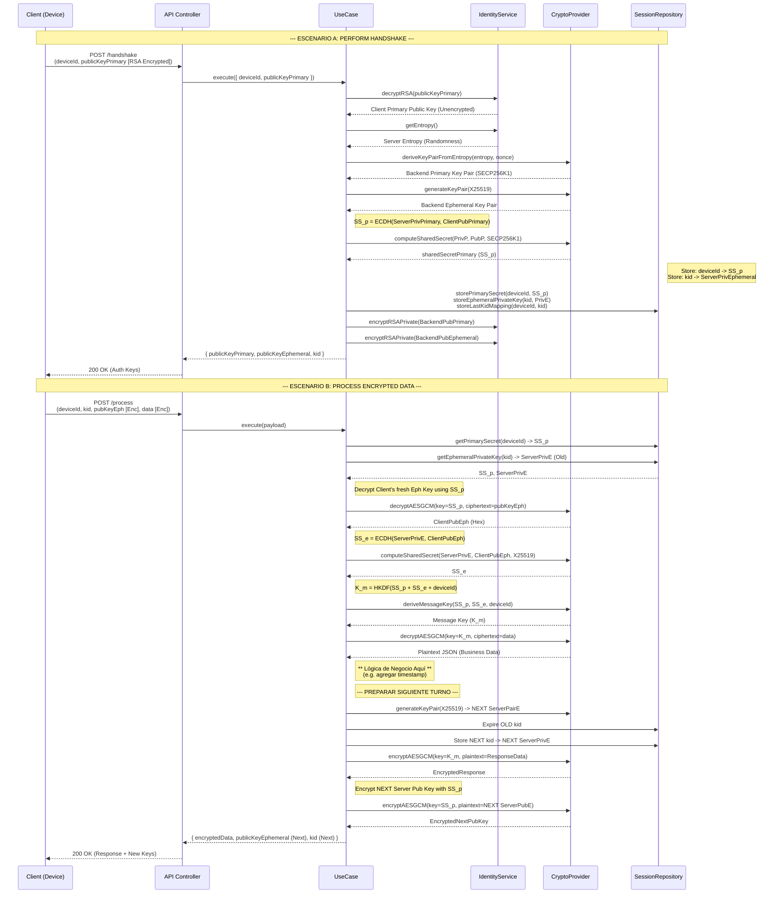

# Especificación Técnica de Flujo Backend

Este documento complementa la especificación de cliente, detallando la lógica interna del backend (`src`), incluyendo la interacción con Repositorios (Redis), Proveedores de Criptografía, y Servicios de Identidad.

## Constantes del Backend
Estas constantes definen el comportamiento crítico de seguridad en el servidor.

| Constante | Valor | Descripción |
|-----------|-------|-------------|
| **Curva Primaria** | `SECP256K1` | Usada para derivar identidades persistentes desde entropía. |
| **Curva Efímera** | `X25519` | Usada para claves de sesión de un solo uso. |
| **HKDF Info** | `"HandshakeMessageKey"` | Contexto para derivación de claves de mensaje. |
| **Nonce Entropy** | `32 bytes` | Longitud del nonce para derivación primaria. |
| **TTL Sesión** | `86400s` (24h) | Tiempo de vida de la sesión activa en Redis. |
| **TTL Key Expirada**| `300s` (5m) | Tiempo de tolerancia para claves efímeras rotadas (prevención de race conditions). |

## Diagrama de Secuencia Detallado

El siguiente diagrama muestra el flujo exacto implementado en los casos de uso `PerformHandshake` y `ProcessEncryptedData`.

## Detalles de Lógica Interna

### 1. Modelo Híbrido de Llaves
*   **Primary Key (Identidad)**: Se utiliza `SECP256K1`. En el backend, esta llave no es estática en disco, sino que se deriva dinámicamente usando una entropía maestra (`IdentityService.getEntropy()`) y un nonce aleatorio. Esto permite que el servidor regenere sus claves si es necesario, pero manteniendo unicidad por sesión.
*   **Ephemeral Key (Forward Secrecy)**: Se utiliza `X25519`. Se genera un nuevo par `(PrivE, PubE)` para cada handshake y para cada respuesta subsecuente (rotación continua).

### 2. Derivación de Llave de Mensaje (K_m)
Para asegurar que los mensajes estén autenticados tanto por la identidad de largo plazo como por la sesión efímera, la llave de cifrado `K_m` se deriva combinando ambos secretos:

> **K_m = HKDF( Salt=deviceId, IKM=(SS_p || SS_e), Info="HandshakeMessageKey" )**

Donde:
*   `SS_p` (Shared Secret Primary): Resultado de `ECDH(ServerPrivPrimary, ClientPubPrimary)`. Persiste en Redis por la duración de la sesión.
*   `SS_e` (Shared Secret Ephemeral): Resultado de `ECDH(ServerPrivEphemeral, ClientPubEphemeral)`. Cambia con cada mensaje.

### 3. Mecanismo de Rotación (Ratchet Simplificado)
Para garantizar *Perfect Forward Secrecy* (PFS):
1.  En cada respuesta `/process`, el servidor genera inmediatamente un **nuevo par efímero** y un **nuevo KID**.
2.  La clave privada efímera vieja asociada al request actual se marca con un TTL corto (`EXPIRED_KEY_SECONDS = 300s`) para permitir reintentos breves en caso de fallos de red, pero se descarta rápidamente.
3.  El cliente **debe** actualizar su estado con el nuevo `publicKeyEphemeral` y `kid` recibidos para poder enviar el siguiente mensaje.

### 4. Seguridad de Tránsito
*   **Handshake**: Las claves públicas del servidor viajan cifradas con RSA (clave privada del servidor, verificable por el cliente con la pública del servidor) o RSA Encryption dependiendo de la dirección.
*   **Process**:
    *   La clave pública efímera del cliente (`publicKeyEphemeral`) viaja cifrada con AES-GCM usando el secreto primario `SS_p`. Esto autentica que quien envía la clave efímera posee la identidad primaria correcta.
    *   La nueva clave pública efímera del servidor (en la respuesta) también viaja cifrada con `SS_p`.
