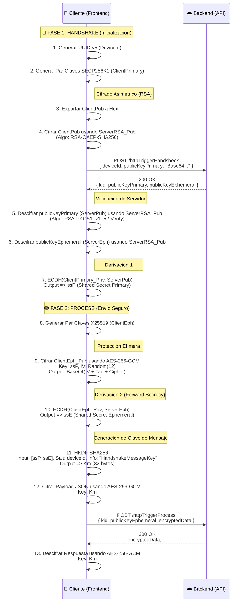

# Especificación de Integración Cliente (End-to-End Encryption)

Este documento detalla el flujo criptográfico paso a paso para implementar la comunicación segura con el backend en cualquier lenguaje cliente (JavaScript/TypeScript, Swift, Kotlin, C#).

## Constantes Universales
| Parámetro | Valor | Notas |
|-----------|-------|-------|
| **Curva Primaria** | `secp256k1` | Usada para identidad persistente del dispositivo. |
| **Curva Efímera** | `X25519` | Usada para rotación de claves por sesión (Forward Secrecy). |
| **RSA Padding** | `OAEP` + `SHA256` | Para cifrado hacia el servidor. |
| **RSA Verify** | `PKCS1` | Para verificar/descifrar respuestas del handshake. |
| **AES Algo** | `AES-256-GCM` | IV=12 bytes, Tag=16 bytes. |
| **HKDF Hash** | `SHA-256` |  |
| **HKDF Info** | `"HandshakeMessageKey"` | String literal. |

## Diagrama de Secuencia de Implementación

## Detalles de Implementación Técnica

### 1. Formato de Paquete Cifrado (AES-GCM)
Siempre que se cifre con AES-GCM, el resultado debe concatenarse y codificarse en **Base64** de la siguiente forma:
`Base64( IV [12 bytes]  +  AuthTag [16 bytes]  +  Ciphertext [n bytes] )`

Para descifrar:
1. Decodificar Base64 a bytes.
2. Extraer primeros 12 bytes -> **IV**.
3. Extraer siguientes 16 bytes -> **AuthTag**.
4. El resto es el **Ciphertext**.

### 2. Conversión de Claves
*   **Hex vs PEM**: El servidor suele trabajar con claves en formato Hexadecimal para ECDH. Asegúrese de convertir formatos si su librería nativa exporta en PEM o DER.
*   **X25519**: Tenga cuidado con el "endianness". Azure/Node.js suelen usar Big Endian o Raw bytes directos. 

### 3. Función HKDF
Si su lenguaje no tiene HKDF nativo, implemente el RFC 5869:
*   **Extract**: Pseudorandom Key (PRK) = HMAC-Hash(salt, IKM)
*   **Expand**: Output = HMAC-Hash(PRK, Info + 0x01)
*   **Inputs**:
    *   `IKM` (Input Key Material): Concatenación de bytes de `ssP` + `ssE`.
    *   `Salt`: Bytes del `deviceId` (UTF-8).
    *   `Info`: Cadena "HandshakeMessageKey".

---
**Nota para Desarrolladores Front-End**:
Este flujo garantiza que incluso si la clave efímera de una sesión es comprometida, las sesiones futuras (que usarán nuevas claves X25519) permanecen seguras, y la identidad del dispositivo está protegida por la clave primaria SECP256K1.
